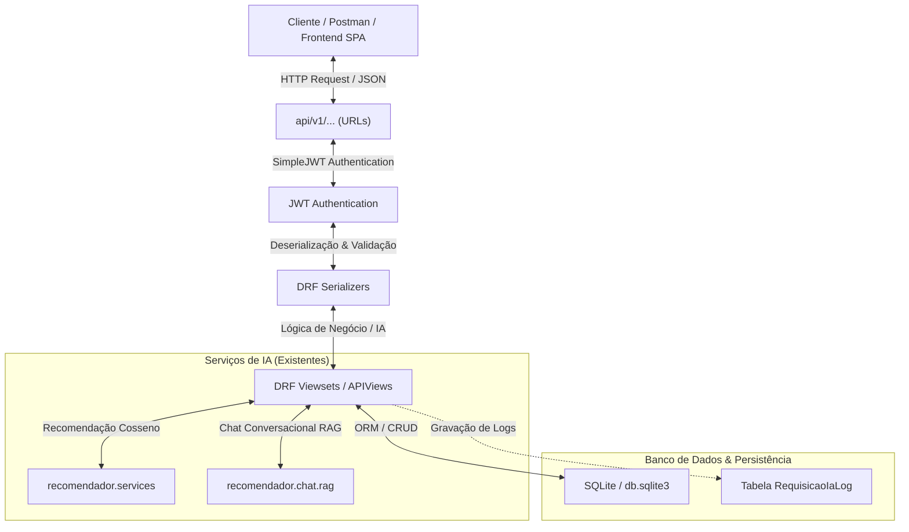

# Planejamento do Projeto: API REST com IA e JWT (Trabalho Final - T2)

Este documento contém o planejamento de execução, decisões de design, especificação técnica de endpoints e divisão equilibrada de tarefas do grupo para o **Trabalho Final (T2)** da disciplina de **Construção de APIs para Inteligência Artificial** (UFG).

- **Professor:** Rogério
- **Data de Entrega Final:** 30 de junho de 2026
- **Entregáveis Obrigatórios:** Repositório GitHub + Vídeo demonstrativo e técnico (até 10 minutos) + Apresentação Técnica.

---

## 1. Arquitetura da API e Integração Django

A API será implementada utilizando o **Django REST Framework (DRF)** rodando em paralelo à aplicação web clássica já desenvolvida. Isso permite o reaproveitamento de 100% dos modelos de banco de dados (`livro`, `pessoa`, `emprestimo`), signals, embeddings vetoriais HuggingFace locais e lógica do assistente RAG com Groq, sem a necessidade de reescrever ou migrar o backend para outro framework.



### Decisões Técnicas Principais:
1. **Framework:** Django REST Framework (DRF) para reuso total do backend Django.
2. **Versionamento:** Todos os recursos da API estarão sob o prefixo `/api/v1/`.
3. **Autenticação & Segurança:** Uso de **JSON Web Tokens (JWT)** via pacote `djangorestframework-simplejwt`.
4. **Demonstração Funcional:** Um **Frontend Cliente SPA (Single Page Application)** moderno em HTML/JS/Tailwind CSS servido diretamente pelo Django para testar e validar o consumo das rotas autenticadas de forma visual e interativa.
5. **Documentação OpenAPI:** Geração automática da especificação OpenAPI 3.0 via `drf-spectacular` exposta no próprio projeto.

---

## 2. Especificação dos Endpoints

### 2.1. Autenticação (SimpleJWT)

* **Obter Token (Login):** `POST /api/v1/auth/token/`
  * *Entrada (JSON):* `{"username": "admin", "password": "..."}`
  * *Resposta (200 OK):* `{"access": "access_token_jwt", "refresh": "refresh_token_jwt"}`
* **Atualizar Token (Refresh):** `POST /api/v1/auth/token/refresh/`
  * *Entrada (JSON):* `{"refresh": "refresh_token_jwt"}`
  * *Resposta (200 OK):* `{"access": "novo_access_token_jwt"}`

### 2.2. Serviços de Inteligência Artificial

#### A. Recomendação Semântica
* **Rota:** `POST /api/v1/ia/recomendar/`
* **Headers:** `Authorization: Bearer <access_token>`
* **Entrada (JSON):**
  ```json
  {
    "livro_id": 12,
    "quantidade": 5
  }
  ```
* **Resposta (200 OK):**
  ```json
  {
    "livro_origem": { "id": 12, "titulo": "Clean Code" },
    "recomendacoes": [
      { "id": 15, "titulo": "The Pragmatic Programmer", "score_similaridade": 0.895 },
      { "id": 3, "titulo": "Refactoring", "score_similaridade": 0.842 }
    ]
  }
  ```

#### B. Assistente Conversacional RAG
* **Rota:** `POST /api/v1/ia/chat/`
* **Headers:** `Authorization: Bearer <access_token>`
* **Entrada (JSON):**
  ```json
  {
    "pergunta": "Quais livros tratam de banco de dados no acervo?"
  }
  ```
* **Resposta (200 OK):**
  ```json
  {
    "pergunta": "Quais livros tratam de banco de dados no acervo?",
    "resposta": "No acervo constam obras clássicas sobre banco de dados, como 'Sistemas de Banco de Dados' (Obra #5)...",
    "obras_citadas": [
      { "id": 5, "titulo": "Sistemas de Banco de Dados" }
    ],
    "timestamp": "2026-06-02T03:50:00Z"
  }
  ```

### 2.3. Endpoints de CRUD Completo
Todas as rotas exigirão o cabeçalho `Authorization: Bearer <access_token>` (com controle de permissões por grupo, ex: leitores só dão GET, bibliotecárias dão POST/PUT/DELETE).

* **Livros:** `/api/v1/livros/` (GET, POST, PUT, DELETE)
* **Pessoas (Leitores/Bibliotecárias):** `/api/v1/pessoas/` (GET, POST, PUT, DELETE)
* **Empréstimos:** `/api/v1/emprestimos/` (GET, POST, PUT, DELETE)
  * *Observação:* O fluxo de empréstimo deve conter as mesmas validações do MVP (verificar se há exemplares disponíveis, deduzir automaticamente, e calcular a data prevista de devolução).

---

## 3. Requisitos de Qualidade (Critérios de Avaliação)

1. **Validação de Dados:** Os serializers do DRF validarão todos os campos das requisições de entrada, impedindo inputs inconsistentes ou vazios e retornando erros estruturados (HTTP 400).
2. **Tratamento de Erros:** Um manipulador de erros global do DRF garantirá retornos uniformes de falhas no formato JSON:
   ```json
   {
     "error": "Mensagem descritiva do erro.",
     "details": "Mensagem detalhada do sistema (opcional)",
     "status_code": 401
   }
   ```
3. **Logs e Auditoria:**
   * Loggers rotativos do Django gravando erros e requisições HTTP em `django.log`.
   * Tabela SQLite `RequisicaoIaLog` para auditoria do Chat RAG e recomendações de IA.
4. **Frontend Cliente SPA:** Tela interativa em HTML/JS/Tailwind CSS servida em `/api/v1/dashboard-cliente/` para demonstrar o consumo completo da API REST autenticada com JWT (Login -> Armazenamento em localStorage -> Consumo de rotas CRUD e IA).

---

## 4. Divisão Equilibrada de Tarefas (5 Pessoas)

Com o objetivo de equilibrar o esforço de forma justa, as atribuições foram mapeadas com base nas afinidades e papéis desempenhados pelo time no planejamento da disciplina **ePrompt (Grupo 5)**:

### 🛠️ Par de Desenvolvimento Core (Desenvolvimento de Código e Arquitetura)

#### **1. Antonio Jansen (Dev 1 - Infraestrutura & CRUD)**
- **Meta:** Colocar o esqueleto da API DRF de pé e fornecer as rotas CRUD de dados.
- **Atividades:**
  - Instalar e configurar o `djangorestframework` no projeto Django.
  - Criar o aplicativo `api/` e configurar a estrutura de urls sob `/api/v1/`.
  - Desenvolver os Serializers e Viewsets para as tabelas de CRUD: `livro`, `pessoa` e `emprestimo` (incluindo a lógica de decremento de exemplares e data de devolução).

#### **2. Jucelino Santos (Dev 2 - Serviços de IA & Frontend SPA)**
- **Meta:** Implementar os endpoints de IA e criar o frontend visual cliente da API.
- **Atividades:**
  - Criar os endpoints de IA (`/api/v1/ia/recomendar/` e `/api/v1/ia/chat/`), integrando-os com os códigos existentes no app `recomendador` (HuggingFace e Groq).
  - Implementar o *Custom Exception Handler* global do DRF para retornar qualquer erro de sistema como JSON formatado.
  - Desenvolver o arquivo `dashboard_cliente.html` (com Tailwind e Fetch API em JS puro) para demonstrar visualmente o login JWT, CRUD e o chat de IA consumindo a API.

---

### 📋 Grupo de Suporte e Qualidade (Configurações, Segurança, QA e Vídeo)

#### **3. Vanderson Darriba (Segurança & Autenticação JWT)**
- **Meta:** Garantir a proteção das rotas e a autenticação via JSON Web Tokens.
- **Atividades:**
  - Configurar as chaves JWT no `settings.py` (SimpleJWT settings) e chaves de expiração.
  - Configurar as classes de permissão do DRF nas Viewsets (garantir que leitores só usem GET e editores usem POST/PUT/DELETE).
  - Validar as chaves de ambiente no `.env.example` e as regras de segurança locais.

#### **4. Ronny Marcelo (Qualidade de Dados, Logs & Auditoria)**
- **Meta:** Garantir que dados ruins não entrem na API e que todas as operações sejam logadas para auditoria.
- **Atividades:**
  - Implementar validações estritas nos Serializers criados pelo Antonio (ex: validar ISBN, formato de dados, limites de caracteres no prompt de IA).
  - Configurar o dicionário `LOGGING` em `settings.py` para gerar logs da API em console e arquivo `django.log`.
  - Criar a tabela `RequisicaoIaLog` e integrar a gravação das perguntas e respostas de IA para fins de auditoria técnica.

#### **5. Givanildo Gramacho (QA, Postman & OpenAPI)**
- **Meta:** Prover as ferramentas de teste da API e gerar a documentação interativa.
- **Atividades:**
  - Criar a Coleção Postman (com fluxo automático de login: salvar o token JWT no ambiente e injetar nas rotas protegidas) e exportá-la para o repositório.
  - Desenvolver os testes de integração automatizados (`APITestCase` do Django) para validar os fluxos válidos e inválidos das APIs (CRUD, IA e login JWT).
  - Configurar o `drf-spectacular` para expor o Swagger UI e ReDoc em `/api/v1/docs/`.

---

## 5. Roteiro e Entrega da Apresentação em Vídeo (Colaborativo)

O vídeo final de até 10 minutos (conforme as diretrizes do ePrompt e da UFG) será dividido de forma que todos participem da entrega:
- **Roteiro e Slides (Vanderson, Ronny & Givanildo):** Montar a estrutura da apresentação explicando o problema da biblioteca e o mapeamento dos agentes e APIs de IA.
- **Gravação e Demonstração Técnica (Antonio & Jucelino):** Gravar a tela demonstrando os endpoints via Postman, Swagger e interagindo com a interface Frontend SPA, finalizando com a edição e publicação do vídeo.

---

## 6. Cronograma Sugerido de Entregas (Milestones)

| Milestone | Período | Meta |
|---|---|---|
| **M1: Setup & CRUD** | 02/06 a 09/06 | App `api` criado, DRF rodando, serializers de CRUD e autenticação JWT integrados. |
| **M2: Serviços de IA & Frontend** | 10/06 a 16/06 | Endpoints de IA funcionando, logs gravando no banco e o protótipo do Frontend SPA consumindo o JWT. |
| **M3: QA & Docs** | 17/06 a 23/06 | Testes automatizados rodando. Coleção Postman pronta. Documentação Swagger interativa ativada. README atualizado. |
| **M4: Vídeo & Ship** | 24/06 a 30/06 | Vídeo gravado e publicado. Revisão final dos critérios da avaliação e submissão no SIGAA. |
